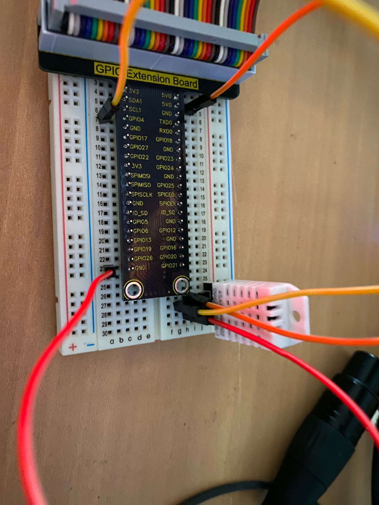

# temperature-sensors
Some practice and fun with some dht22 sensors for temperature and humidty connected to a raspberry pi 4

## Tech i use for that:
- Python Djano Rest API because it is an easy way to display my data in my network
- The Adafruit_DHT Library for an easy way to obtain data from the sensors

## Breadboard
This is what my sensor wiring looks like. Data can be read from the GPIO4 Pin on the pi.
